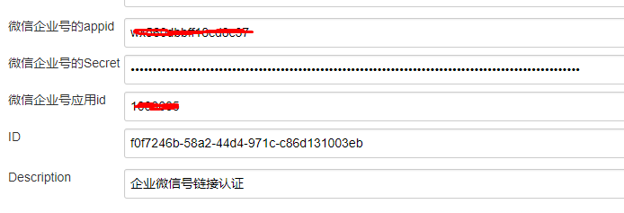
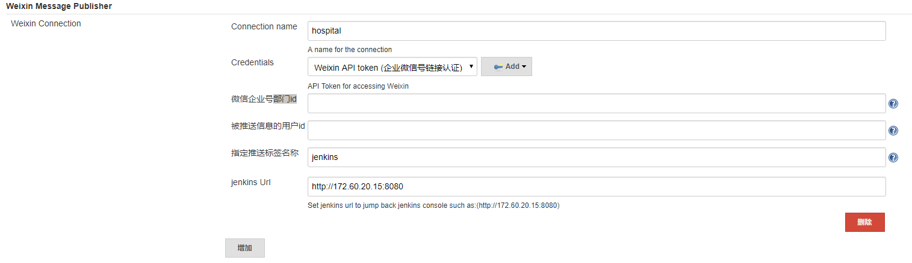
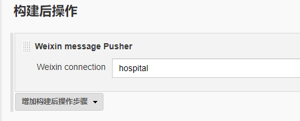

Jenkins Weixin Message Publisher Plugin
===================== 

介绍
===========
本插件基于jenkins实现将用户项目构建状态（结果）推送至微信企业号的功能。

为何使用微信企业号(团队号)
--------------------------
1. 微信使用较邮箱频繁，有问题及时知晓

2. 如果手机停机，短信不可达

3. 短信受限于70字符，如果大段文字，容易导致短信费激增(微信文本消息，最长2048个字节 1汉字=2字母=2字节)

4. 微信企业号支持发送文本、图片、语音、视频、文件、图文等消息类型，方式多样

5. 减少运维费用（报警类的短信量会比较大，费用高，而微信推送费用为0）

6. 部分手机会或邮箱会将报警信息拉入黑名单，导致干系人无法及时获知报警信息

7. 基于标签发送，更灵活的管理接收报警信息的人员，不必要硬编码

不足
--------------------------
1. 客户端未登陆，客户端无网络情况下，会延迟接收（但不会丢信息）

2. 未认证企业号叫团队号，上限为200人

3. api创建的标签默认是锁定状态，需要管理员手动解锁并添加成员

注意
------
如果指定标签名称不存在，会自动通过api创建一个标签（处于锁定状态），需要管理员，手动解锁，并且添加成员 如果指定标签下没有成员(标签添加部门无效)，则会根据cp.properties指定的部门idPartyId和人员idUserId进行发送 如果部门下没有成员，而且指定的用户也没有关注该企业号，则会将信息推送给该企业号全部已关注成员，测试时需谨记

使用说明
------------

1. 配置Credentials认证。进入Credentials界面，点击Add Credentials添加新的认证，在Kind中选择Weixin API token配置企业微信号的相关信息。

2. 进入系统管理-》系统设置，进入Weixin Message Publisher配置段。点击添加可设置微信链接，包括：链接名称、认证、部门id、用户id以及标签名称。同时可点击高级，设置jenkins服务器地址，用于微信通知的跳转页面链接。

3. 进入job设置界面，点击构建后操作，选择之前配置的链接名称。 

提示：本插件已适配pipeline项目
-------------------------------------

开发
===========

运行本地Jenkins实例进行测试：

    mvn hpi:run

Jenkins 插件全局命令
--------------------------

	hpi:create  Creates a skeleton of a new plugin.
	
	hpi:hpi Builds the .hpi file
	
	hpi:hpl Generates the .hpl file
	
	hpi:run Runs Jenkins with the current plugin project
	
	hpi:upload Posts the hpi file to java.net. Used during the release.

如何安装该插件
--------------

运行

	mvn hpi:hpi

去创建hpi文件

安装方式：

1. 复制由上述命令创建的 ./target/XXXX.hpi 文件到$JENKINS_HOME/plugins 目录，请不要忘记重启jenkins服务。

2. 或者使用插件管理控制台（http://example.com:8080/pluginManager/advanced)上传该hpi文件。注意：上传完毕之后，必须重启jenkins服务

